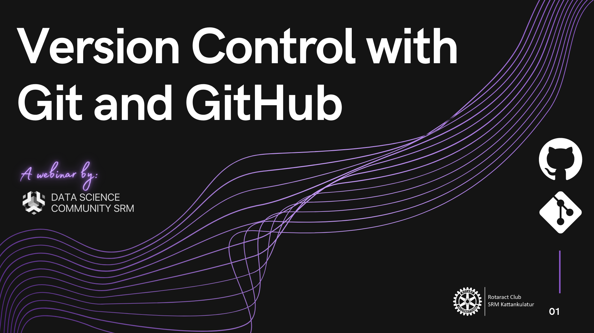
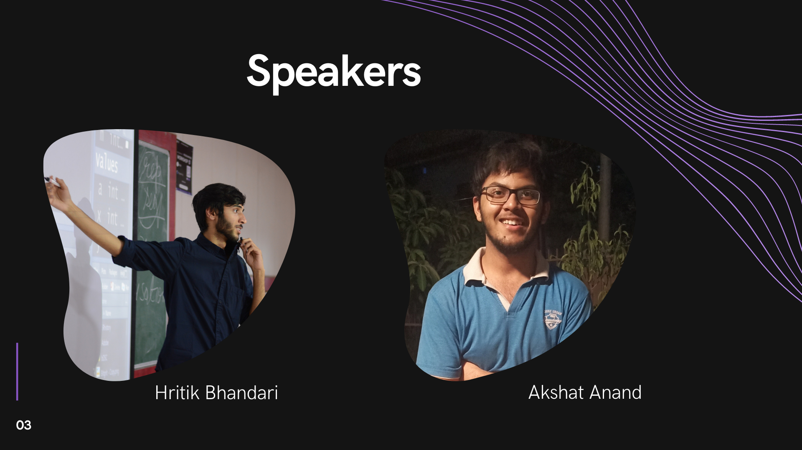

# Version control with Git and GitHub

 

 Links for important Resources:

- <a href="https://training.github.com/downloads/github-git-cheat-sheet/">Git Cheat Sheet </a>
 - <a href="https://guides.github.com/introduction/flow/"> GitHub Flow </a>
 - <a href="https://githubtraining.github.io/training-manual/#/01_getting_ready_for_class"> GitHub for Developers </a>
 - <a href="https://github.blog/2015-01-21-how-to-write-the-perfect-pull-request/">Writing the perfect Pull Request </a>
 - <a href="https://dev.to/chrissiemhrk/git-commit-message-5e21"> Writing the Perfect Commit Message </a>

## Attendees
1. Hritik Bhandari
2. Abhishek Saxena
3. Aditya Shukla
4. Shubhangi Soni
5. Nishnatadebnath
6. Mohit
7. Shinjinee Maiti
8. Anant Kanchan
9. Sumanth
10. Jayesh Jayanandan
11. Mimansa Sharma
12. Karan Bengani
13. Hritik Bhandari for CodeChef
14. Kushagra Gupta

